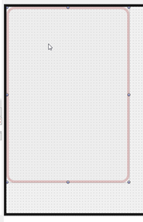

**Динамични екрани в Aspect**

**1\. Въведение**

Динамичните екрани в Aspect **не са създадени с дизайнер** и **не съдържат контроли в design-time**.

Формата в Delphi служи само като:

- визуален контейнер (surface)
- dispatcher на събития
- owner на runtime-създадените контроли

Всички реални контроли, групи от контроли и тяхното поведение се създават **динамично по време на изпълнение**, на база Aspect описания.

**2\. Празна форма - умишлен дизайн**

В design-time формата изглежда напълно празна.

📌 **Това не е грешка.**

Причини:

- екранът зависи от избраната роля
- екранът зависи от активния аспект
- екранът зависи от контекста (пациент, преглед, документ и др.)
- екраните се генерират, а не се проектират ръчно

**3\. Контейнер за контроли (Control Pool)**

Aspect използва централен контейнер за контроли, който съдържа:

- предварително създадени визуални компоненти
- групи от контроли
- шаблони за полета (text, number, date, logical, list)

Тези контроли:

- **не се показват директно**
- служат като шаблони
- се **клонират** при нужда

По този начин:

- не се създават контроли от нулата
- всички екрани имат унифициран външен вид
- управлението на стилове е централизирано

**4\. Създаване на динамичен екран (Lifecycle)**

Всеки динамичен екран преминава през следния lifecycle:

- Създаване на празна форма
- Избор на роля
- Зареждане на аспект описание
- Клониране на нужните контроли
- Свързване на контролите с данните
- Закачане на събития
- Показване на екрана

**5\. Свързване на контроли с данни (Binding)**

Контролите не съдържат директна бизнес логика.

Всяко поле:

- знае към кой аспект принадлежи
- знае кой property представя
- работи с DataPos, а не с обекти

Това позволява:

- работа с огромни бази без зареждане на обекти
- бързо превключване между записи
- минимална памет

**6\. Роли и динамични екрани**

Ролята определя:

- кой аспект е корен
- кои екрани са достъпни
- каква навигация е позволена
- кои действия са активни

UI **не познава конкретни роли**.  
Той работи с TRoleCollection.

При избор на роля:

- текущият екран се унищожава
- създава се нов динамичен екран
- не се рестартира приложението
- не се презареждат файлове

**7\. Събития и обработка**

Всички събития:

- се обработват в .pas файла
- се закачат динамично
- не съществуват в дизайнер

Примерни събития:

- промяна на стойност
- валидиране
- навигация
- запис
- създаване на нови обекти

Това е причината .pas файловете да са „пълни", а формите - празни.

**8\. Производителност**

Този модел позволява:

- зареждане на екран под 1 ms
- работа с много големи бази
- минимално използване на памет
- незабавна смяна на роля

Това не е възможно със статични форми или SQL ORM модел.

**9\. Често срещани недоразумения**

**„Защо не виждам контролите в дизайнера?"**

          

Защото екранът не е статичен.

**„Защо не използваме SQL екрани?"**

Защото динамичните екрани зависят от аспекти, а не от таблици.

**„Това не е ли прекалено сложно?"**

Сложно е в началото.  
След това позволява неща, които иначе са невъзможни.

**10\. Обобщение**

- Формите са празни по дизайн
- Контролите се клонират динамично
- Ролите определят екраните
- Данните не се зареждат като обекти
- Производителността е водеща цел

Aspect UI е **виртуален UI модел**, а не дизайнерски.

**📌 Забележка**

Този модел е неразривно свързан с:

- Aspect Collections
- Aspect Roles
- ADB / LNK / CMD архитектурата
